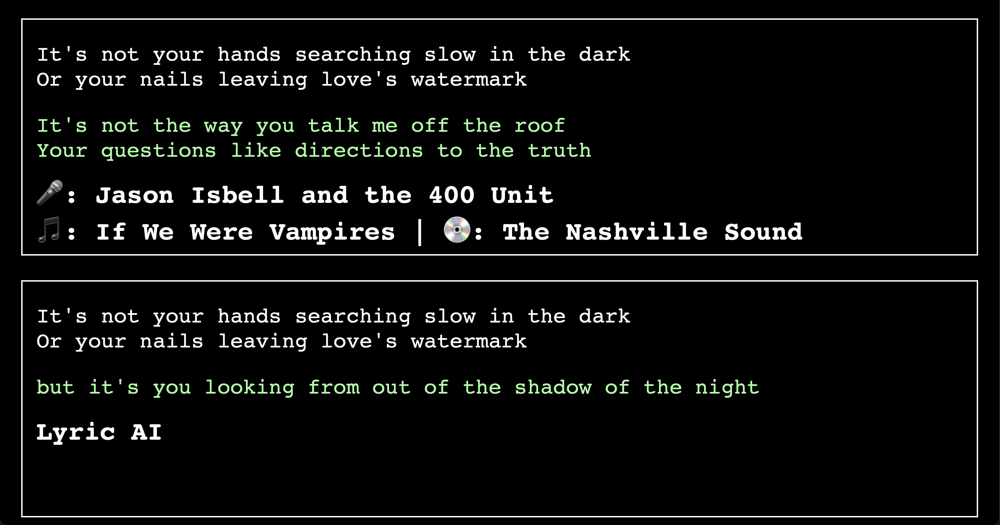
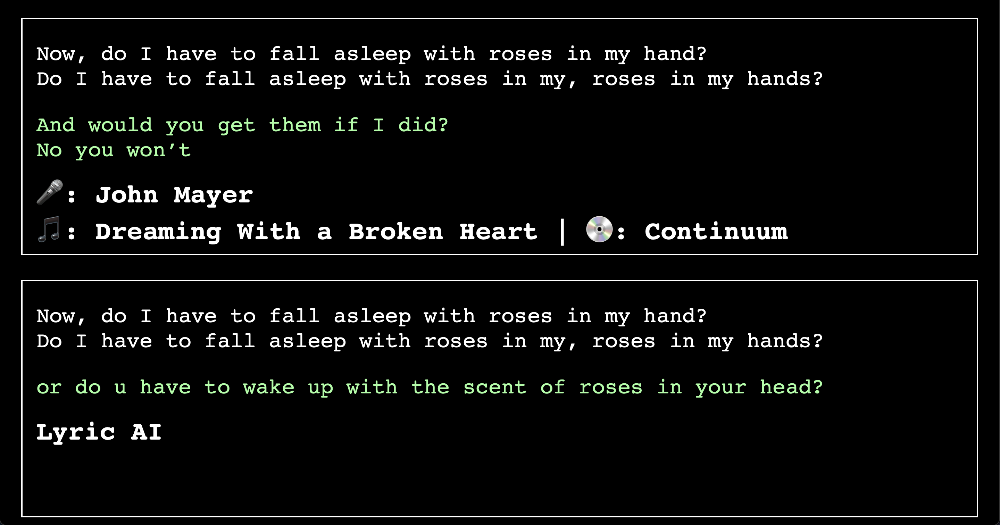

# LyricAI - AI-based Song Lyric Display

This project is a website that you can leave up on a spare TV or monitor to provide endless entertainment.

You start by giving LyricAI your favorite albums. It then picks random song lyrics, shows how the original artist followed up those lyrics, and compares it with what AI thinks should go next! This is best demonstrated by example. Here are a few of my favorites:

Wow, how profound.

Truly a poet.

You can run this Python script on a Raspberry Pi [works with Model 3B (1 GB RAM), but Model 4 w/ >1 GB RAM reccommended]. I have it running on my Pi connected to my television. It's truly entertaining!

This project is powered by GPT-2, a very large language model trained on textual data from the internet.

